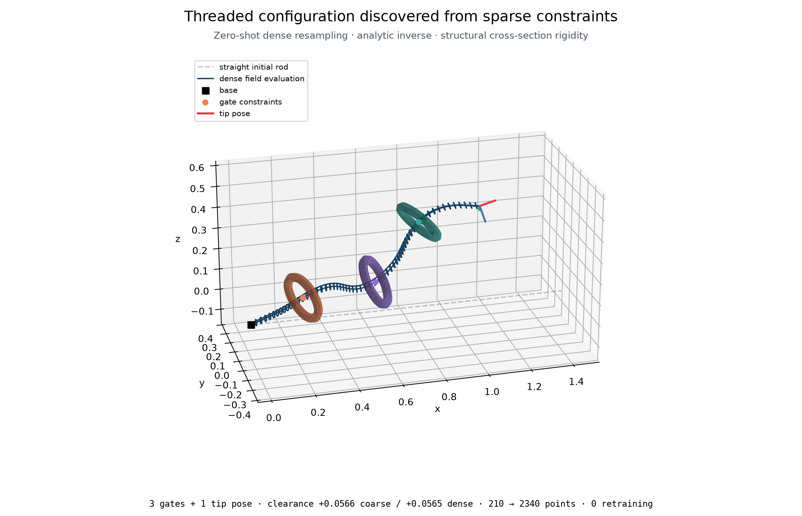

# clifra

[](LICENSE)
[](https://www.python.org/downloads/)
[](https://pytorch.org/)
[](https://concode0.github.io/clifra/)
[](https://doi.org/10.5281/zenodo.18939518)

Layout-first Clifford algebra tools for PyTorch.

clifra keeps Clifford structure explicit in tensor code. An algebra context owns the signature, grade layouts, planning policy, and reusable operation plans. Compact and full-lane tensors use the same layout semantics, while planned products, metrics, exponentials, and geometric actions run through ordinary PyTorch tensor operations. Direct operations, PyTorch modules, diagnostics, and code in research/ share the same algebra and layout machinery.

[Documentation](https://concode0.github.io/clifra/) · [API Reference](https://concode0.github.io/clifra/reference/) · [Benchmarks](https://concode0.github.io/clifra/benchmarks/)

## What clifra provides

- **Layouts and tensor contracts.** Signatures, grade layouts, and compact or full-lane storage make the Clifford meaning of a tensor explicit.

- **Planned Clifford operations.** Products, unary operations, metric forms, bivector exponentials, and versor actions can be planned once and reused. Planning policies and resource limits select among supported execution routes.

- **Functions and PyTorch modules.** Stateless helpers cover algebraic and coefficient-level operations, while reusable modules provide Clifford-linear maps, products, versor and reflection actions, normalization, activations, and attention.

- **Analysis and optimization tools.** Analysis modules cover dimension, signature, spectral, symmetry, transformation, and commutator diagnostics. Optimizer helpers provide manifold tags, parameter grouping, tangent projection, and retractions.

## Install

```bash
uv add clifra
```

## Quick start

This example uses explicit planning to make clifra's execution model visible: layouts and execution choices are resolved into a reusable operation. For ordinary call sites, direct algebra methods are the concise default and planner-backed calls reuse the algebra's internal caches.

```python
import torch

from clifra import make_algebra

algebra = make_algebra(3, 0, device="cpu")
vectors = algebra.layout((1,))
products = algebra.plan_product(
    op="gp",
    left_layout=vectors,
    right_layout=vectors,
    output_layout=algebra.layout((0, 2)),
)

left = torch.randn(8, vectors.dim)
right = torch.randn(8, vectors.dim)
out = products(left, right)
```

## Research with clifra

`research/` contains experimental systems built on clifra's public primitives and kept outside the installed package API.

**Transformation Fields** is an experimental subsystem for differentiable fields of Clifford-generated local actions over persistent sampling domains.

### Sparse-Constraint Continuum Threading

The example optimizes a material-space SE(3) transformation field using three sparse, material-tagged gate constraints and one tip pose, producing a collision-free continuum configuration. No target centerline is supplied. The field is optimized on 210 points and evaluated directly on a 2,340-point discretization without retraining. Rigid cross-sections and analytic inversion come from the representation itself.



```bash
uv run --group viz research/transformation_fields/examples/sparse_continuum_threading.py
```

## Development and contribution

Install development dependencies:

```bash
uv sync --group dev
```

Run checks:

```bash
uv run --group dev ruff check .
uv run --group dev pytest tests/ -n12 -q --tb=short
uv run --group dev pytest tests/ --hypothesis-profile=full -n12 -q --tb=short
```

Docs:

```bash
uv sync --group docs
uv run --group docs mkdocs serve
uv run --group docs mkdocs build
```

Visualization dependencies used by research examples:

```bash
uv sync --group viz
```

### Contribution

Found a problem or want to propose a change? Please open an Issue first,
especially before a PR, so the scope is clear.

For direct contact, email: nemonanconcode@gmail.com


## Citation

```bibtex
@software{kim2026clifra,
  author  = {Kim, Eunkyum},
  title   = {clifra: Layout-first Clifford algebra tools for PyTorch},
  url     = {https://github.com/Concode0/clifra},
  version = {1.3.1},
  year    = {2026},
  doi     = {10.5281/zenodo.18939518},
  license = {Apache-2.0}
}
```

## License

Apache License 2.0. See [LICENSE](LICENSE) and [NOTICE](NOTICE).
